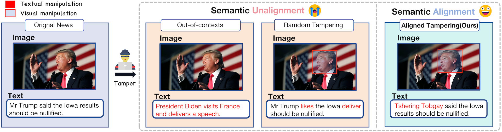
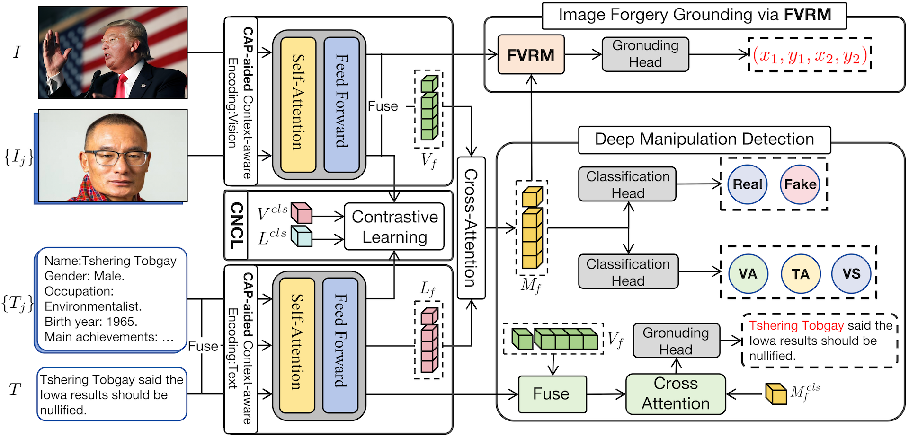
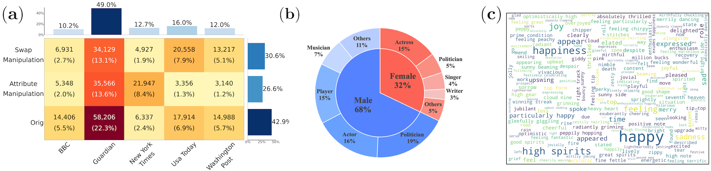
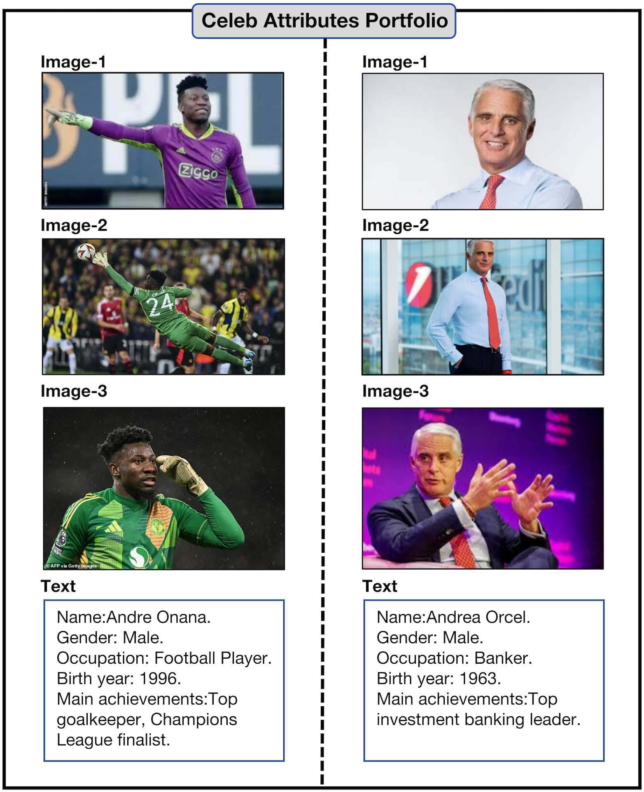
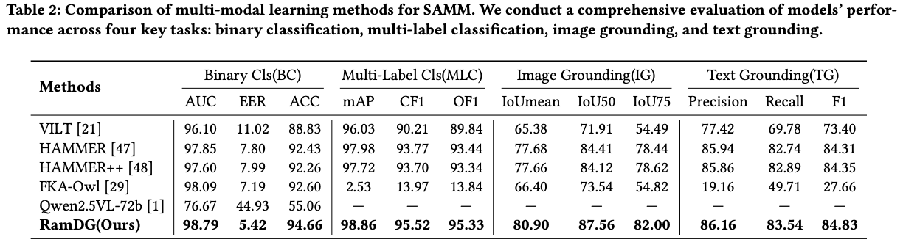

<div align="center">
<h1>Beyond Artificial Misalignment: Detecting and Grounding Semantic-Coordinated Multimodal Manipulation(ACM MM2025)</h1>

<div>
  Jinjie Shen<sup>1</sup></a>
  Yaxiong Wang<sup>1</sup></a>
  Lechao Chen<sup>1</sup></a>
  Pu Nan<sup>2</sup></a>
  Zhun Zhong<sup>1</sup></a>
</div>

<div>
    <sup>1</sup>Hefei University of Technology
    <br>
    <sup>2</sup> University
</div>
</div>

<h4 align="center">
  <a href="" target='_blank'>[ACM MM Paper]</a> |
  <a href="https://huggingface.co/datasets/SJJ0854/SAMM" target='_blank'>[Dataset HF
]</a> |
  <a href="" target='_blank'>[CAP]</a>
</h4>

## Notes⚠️

- The SAMM dataset is large. For the convenience of downloading and usage, we provide two download options for SAMM and CAP: Hugging Face and Baidu Pan. <a href="https://huggingface.co/datasets/SJJ0854/SAMM" target='_blank'>[SAMM HF] 
- If you want to import the CAP data into your own dataset, please refer to [this].
## News

- [07/2025] RamDG Code is released.
- [07/2025] Our paper is accepted by ACM MM2025🎉🎉🎉.

## Introduction



This is the official implementation of *SAMM* and *RamDG*. We propose a realistic research scenario: detecting and grounding semantic-coordinated multimodal manipulations, and introduce a new dataset SAMM. To address this challenge, we design the RamDG framework, proposing a novel approach for detecting fake news by leveraging external knowledge.

The framework of the proposed RamDG:



## 🔧 Dependencies and Installation

### Download
```
mkdir code
cd code
git clone https://github.com/shen8424/SAMM-RamDG-CAP.git
cd SAMM-RamDG-CAP
```

### Environment

```
conda create -n RamDG python=3.8
conda activate RamDG
conda install --yes -c pytorch pytorch=1.10.0 torchvision==0.11.1 cudatoolkit=11.3
pip install -r requirements.txt
conda install -c conda-forge ruamel_yaml
```

### ⏬ Prepare Checkpoint

Download the pre-trained model through this link: [ALBEF_4M.pth](https://storage.googleapis.com/sfr-pcl-data-research/ALBEF/ALBEF_4M.pth) and [pytorch_model.bin](https://drive.google.com/file/d/15qfsTHPB-CkEVreOyf-056JWDAVjWK3w/view?usp=sharing)[GoogleDrive].

Then put the `ALBEF_4M.pth` and `pytorch_model.bin` into `./code/SAMM-RamDG-CAP/`.

```
./
├── code
    └── SAMM-RamDG-CAP (this github repo)
        ├── configs
        │   └──...
        ├── dataset
        │   └──...
        ├── models
        │   └──...
        ...
        └── ALBEF_4M.pth
        └── pytorch_model.bin
```

## ⏬ Prepare Data

### Brief introduction

We present <b>SAMM</b>, a large-scale dataset for Detecting and Grounding Semantic-Coordinated Multimodal Manipulation.

**Dataset Statistics:**
<div align="center">

</div>

### Celeb Attributes Portfolio (CAP)

We present <b>CAP</b>, a large-scale database including over 80k celebrities. Each celebrity in the CAP has three associated images along with their gender, birth year, occupation, and main achievements.

Two examples from CAP:

<div align="center">

</div>

#### Import CAP into other datasets.🤗🤗🤗

If you want to import the CAP data into your own dataset, please refer to [this].

### Annotations
```
    {
        "text": "Lachrymose Terri Butler, whose letter prompted Peter Dutton to cancel Troy Newman's visa, was clearly upset.",
        "fake_cls": "attribute_manipulation",
        "image": "emotion_jpg/65039.jpg",
        "id": 13,
        "fake_image_box": [
            665,
            249,
            999,
            671
        ],
        "cap_texts": {
            "Terri Butler": "Terri Butler Gender: Female, Occupation: Politician, Birth year: 1977, Main achievement: Member of Australian Parliament.",
            "Peter Dutton": "Peter Dutton Gender: Male, Occupation: Politician, Birth year: 1970, Main achievement: Australian Minister for Defence."
        },
        "cap_images": {
            "Terri Butler": "Terri Butler",
            "Peter Dutton": "Peter Dutton"
        },
        "idx_cap_texts": [
            1,
            0
        ],
        "idx_cap_images": [
            1,
            0
        ],
        "fake_text_pos": [
            0,
            11,
            13,
            14,
            15
        ]
    }
```

- `image`: The relative path to the original or manipulated image.  
- `text`: The original or manipulated text caption.  
- `fake_cls`: Indicates the type of manipulation (e.g., forgery, editing).  
- `fake_image_box`: The bounding box coordinates of the manipulated region in the image.  
- `fake_text_pos`: A list of indices specifying the positions of manipulated tokens within the `text` string.  
- `cap_texts`: Textual information extracted from CAP (Contextual Auxiliary Prompt) annotations.  
- `cap_images`: Relative paths to visual information from CAP annotations.  
- `idx_cap_texts`: A binary array where the i-th element indicates whether the i-th celebrity in `cap_texts` is tampered (1 = tampered, 0 = not tampered).  
- `idx_cap_images`: A binary array where the i-th element indicates whether the i-th celebrity in `cap_images` is tampered (1 = tampered, 0 = not tampered).

### Download data

😊😊😊We provide two versions: SAMM with CAP information and SAMM without CAP information. If you choose SAMM with CAP information, download CAP and place the downloaded `people_imgs` folder into `./code/SAMM-RamDG-CAP/SAMM_datasets`. 

Then place the `train.json`, `val.json`, `test.json` into `./code/SAMM-RamDG-CAP/SAMM_datasets/jsons` and place `emotion_jpg`, `orig_output`, `swap_jpg` into `./code/SAMM-RamDG-CAP/SAMM_datasets`.

```
./
├── code
    └── SAMM-RamDG-CAP (this github repo)
        ├── configs
        │   └──...
        ├── dataset
        │   └──...
        ├── models
        │   └──...
        ...
        └── SAMM_datasets
        │       ├── jsons
        │       │   ├──train.json
        │       │   │
        │       │   ├──test.json
        │       │   │
        │       │   └──val.json
        │       ├── people_imgs
        │       │
        │       ├── emotion_jpg
        │       │
        │       ├── orig_output
        │       │
        │       └── swap_jpg
        ├── models
        │   
        └── pytorch_model.bin
```

## 💻 Training RamDG
To train RamDG on the SAMM dataset, please modify `train.sh` and then run the following commands:
```yaml
bash train.sh
```

## 💻 Testing RamDG

To test RamDG on the SAMM dataset, please modify `test.sh` and then run the following commands:
```yaml
bash test.sh
```

## Benchmark Results
Here we list the performance comparison of SOTA multi-modal and our method. Please refer to our paper for more details.



## Model checkpoint

Checkpoint of our trained model on the SAMM: [best-model-checkpoint](https://drive.google.com/file/d/1woS5gWD9u08tgbVHvfUKhe7bbAE3DtDo/view?usp=sharing)

## 🤗 Acknowledgements
We borrow some codes from [DGM4](https://github.com/rshaojimmy/MultiModal-DeepFake) and pre-trained weights from [ALBEF](https://github.com/salesforce/ALBEF). Thanks for their wonderful work!

## Citation
If you find this work useful for your research, please kindly cite our paper:


